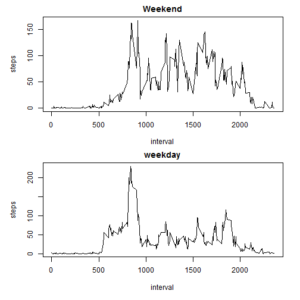

# Reproducible Research: Peer Assessment 1

Please set your work directory!

```r
setwd("C:/Coursera/Reproducible Research/RepData_PeerAssessment1")
```

## Loading and preprocessing the data

```r
activity <- read.csv(unz("activity.zip", "activity.csv"),sep=",")
activity$date <- as.Date(activity$date, format = "%Y-%m-%d")
names(activity)
```

```
## [1] "steps"    "date"     "interval"
```


## What is mean total number of steps taken per day?

Total steps per day

```r
stepsDate <- aggregate(steps ~ date, data = activity, FUN = sum)
barplot(stepsDate$steps, names.arg = stepsDate$date, xlab = "date", ylab = "steps")
```

 

Mean per day

```r
mean(stepsDate$steps)
```

```
## [1] 10766
```

Median per day

```r
median(stepsDate$steps)
```

```
## [1] 10765
```

## What is the average daily activity pattern?

Time series plot of the 5-minute interval and the average number of steps taken, averaged across all days


```r
stepsInterval <- aggregate(steps ~ interval, data = activity, FUN = mean)
plot(stepsInterval, type = "l")
```

 

Which 5-minute interval, on average across all the days in the dataset, contains the maximum number of steps? 


```r
stepsInterval$interval[which.max(stepsInterval$steps)]
```

```
## [1] 835
```


## Imputing missing values

Calculate and report the total number of missing values in the dataset (i.e. the total number of rows with NAs)

```r
sum(is.na(activity))
```

```
## [1] 2304
```


Strategy for filling in all of the missing values in the dataset. Replace missing values with means for the 5-minute intervals


Create a new dataset that is equal to the original dataset but with the missing data filled in.

```r
activityNew <- merge(activity, stepsInterval, by = "interval")
activityNew$steps <- ifelse(is.na(activityNew$steps.x),activityNew$steps.y,activityNew$steps.x)
```


Make a histogram of the total number of steps taken each day and Calculate and report the mean and median total number of steps taken per day. Do these values differ from the estimates from the first part of the assignment? What is the impact of imputing missing data on the estimates of the total daily number of steps?


```r
stepsDateNew <- aggregate(steps ~ date, data = activityNew, FUN = sum)
barplot(stepsDateNew$steps, names.arg = stepsDateNew$date, xlab = "date", ylab = "steps")
```

 


```r
mean(stepsDateNew$steps)
```

```
## [1] 10766
```


```r
median(stepsDateNew$steps)
```

```
## [1] 10766
```

The difference between the data set with and without missing data is minimal:

Difference in Mean

```r
mean(stepsDateNew$steps) - mean(stepsDate$steps)
```

```
## [1] 0
```
Difference in Median:

```r
median(stepsDateNew$steps) - median(stepsDate$steps)
```

```
## [1] 1.189
```

## Are there differences in activity patterns between weekdays and weekends?


```r
activityNew$week_part <- factor(
  ifelse(as.integer(format(activityNew$date, format = '%u')) %in% c(1:5),
         'weekday', 'weekend'))
```

Panels in base plot system


```r
par(mfrow = c(2, 1), oma=c(1,1,0,0), mar=c(4,4,2,2))

stepsWeekend <- aggregate(steps ~ interval, 
                          data = subset(activityNew,week_part == "weekend"), 
                          FUN = mean)
stepsWeekday <- aggregate(steps ~ interval, 
                          data = subset(activityNew,week_part == "weekday"), 
                          FUN = mean)
## add the first
plot(stepsWeekend, type = "l", xlab="interval", ylab="steps", main="Weekend")
## add the second
plot(stepsWeekday, type = "l", xlab="interval", ylab="steps", main="weekday")
```

 

Yes, there seem to be differences! More steps in the weekend.
